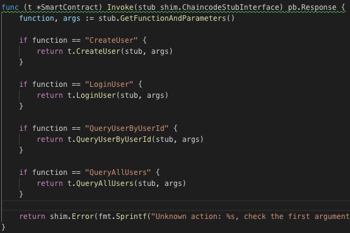
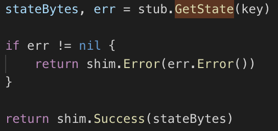

# 4. **chaincode 가이드**

## **chaincode는 shim package를 이용하여 state에 접근**
https://godoc.org/github.com/hyperledger/fabric/core/chaincode/shim
<br><br><br>

## **chaincode의 종류**
- CSCC : Configuration System Chaincode<br>
- LSCC : Life Cycle System Chaincode<br>
- QSCC : Query System Chaincode<br> 
- ESCC : Endorser System Chaincode <br>
- VSCC : Validator System Chaincode<br>
<br><br>


## **chaincode의 형태**
```
package main // go 파일이 위치한 패키지를 나타냄

import () // import하려는 패키지를 나타냄

type SmartContract struct {} // struct를 나타냄

func (t *SmartContract)Invoke() {} // 중요! StateDB에 Update/Query하기 위해 반드시 호출

func (t *SmartContract)Init() {} Instantiate/Upgrade 수행시 호출

func main() {} //golang의 시작점(java의 main함수와 비슷하다고 보면 됨)
```
<br><br>

## **Invoke 구조 예시**

<br><br>

## **shim package 주요 API**
- PutState : 저장<br>

<br><br>
- GetState : 조회<br>

<br><br>
- DelState : 삭제<br>


<br><br>
## **chaincode를 테스트 하는 방법**

1. 테스트 코드 작성하기
2. 실제 네트워크에 올려서 테스트